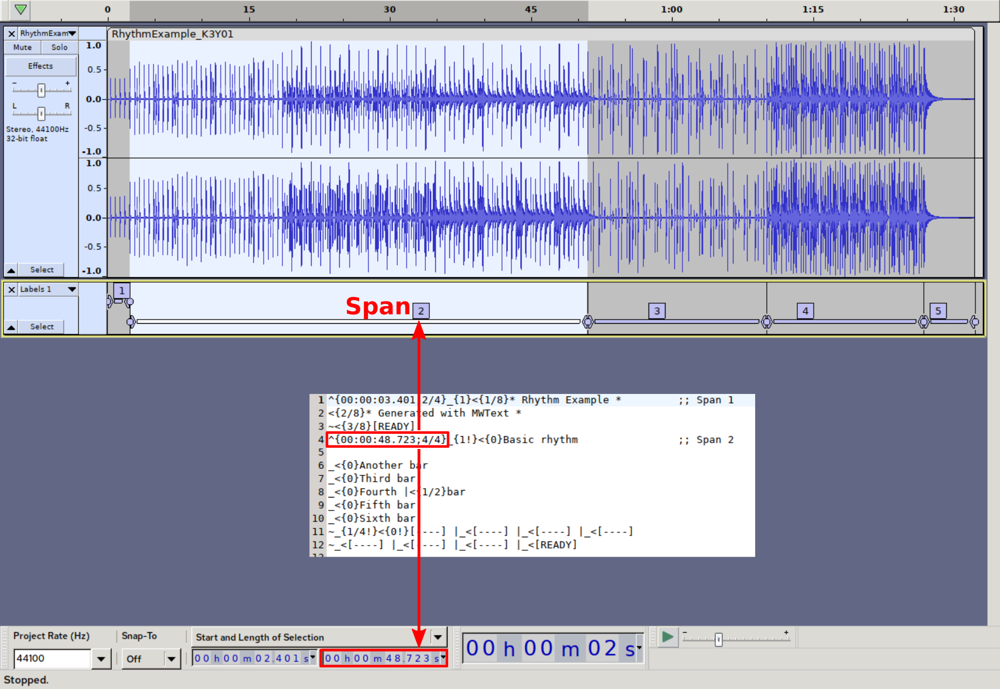

# mwtext

## What is mwtext
The mwtext is an utility (script and the markup syntax at once) to synchronize song lyrics to audio track. Everything can be done in simple text editor.
Plain-text lyrics file (with special tags) is transformed into two products:

1. plain text lyrics file without tags
2. midi file

Both those files become a part of input to [MW21](https://github.com/mk1037/MW21) karaoke player.

Tempo of generated midi file is calculated based on `spans`. The user needs to determine length of spans in the audio track. It can be done with any audio editor, for example: [Audacity](https://www.audacityteam.org/). Accuracy up to milliseconds is enough. Span must indicate time signature (e.g. 4/4). Length of single span must be multiplicity of time signature (i.e. only full bars allowed).

In this example the second span has length of 48.723 seconds and it exactly matches the mwtext file notation.
The only exception is the first span. In audiotrack it has 2.401 seconds duration, but in mwtext file we intentionally added 1 second, thus 3.401 duration. The goal is to compensate MW21 software startup delay (scripts execution, vlc startup etc). This can be also individually aligned with .delay file in MW21.

Typical song has constant tempo - in this case one span for entire song is enough. Sometimes tempo can vary across different parts of the song. Defining few spans is recommended.

Bars are defined with so called 'beats'. Beat is denoted by underscore character (optionally followed with curly brackets containing duration expressed in fraction - i.e. musical duration).

Within span - timing of the events (i.e. pointer advance) is based on typical musical notes durations, e.g. 1/4, 1/8, 3/8 etc. This timing is denoted by so called 'pointers' denoted by '<' or '>' characters, optionally followed by curly brackets containing duration expressed in fraction - i.e. musical duration.

## Installation
Clone `mwtext` repository directly to your home directory:

    cd ~/
    git clone https://github.com/mk1037/mwtext

Just be sure that you have `mido` library installed:

    sudo apt install python3-mido

## Generating files
Let's assume you installed `MW21` directly in your home directory (as described in `MW21` [README](https://github.com/mk1037/MW21/blob/main/README.md) ).

Firstly, please copy example mp3 and delay file to your MW21 collection:

    cp ~/mwtext/RhythmExample_K3Y01/RhythmExample_K3Y01.mp3 ~/MW21/collections/example/bank_3/waves/
    cp ~/mwtext/RhythmExample_K3Y01/RhythmExample_K3Y01.delay ~/MW21/collections/example/bank_3/delay/

Generate lyrics and midi sync-file with command:

    python3 ~/mwtext/mwtext.py -i ~/mwtext/RhythmExample_K3Y01/RhythmExample_K3Y01.mwt -o ~/MW21/collections/example/bank_3/midi/RhythmExample_K3Y01.mid -t ~/MW21/collections/example/bank_3/text/RhythmExample_K3Y01.txt

That is all. Now just start your `MW21` player, select and play the file. Note that after each re-generation of text or midi sync-file, restart of `MW21` is not necessary (files are simply swapped on th disk).

The `mwtext` is licensed with GPL-3.0 license. The underlying 'mido' library is licensed with MIT.

The track used in example is licensed with CC-BY-SA-4.0 license https://creativecommons.org/licenses/by-sa/4.0/

Author of the example soundtrack is Marek Momot <marekm1037@gmail.com>

